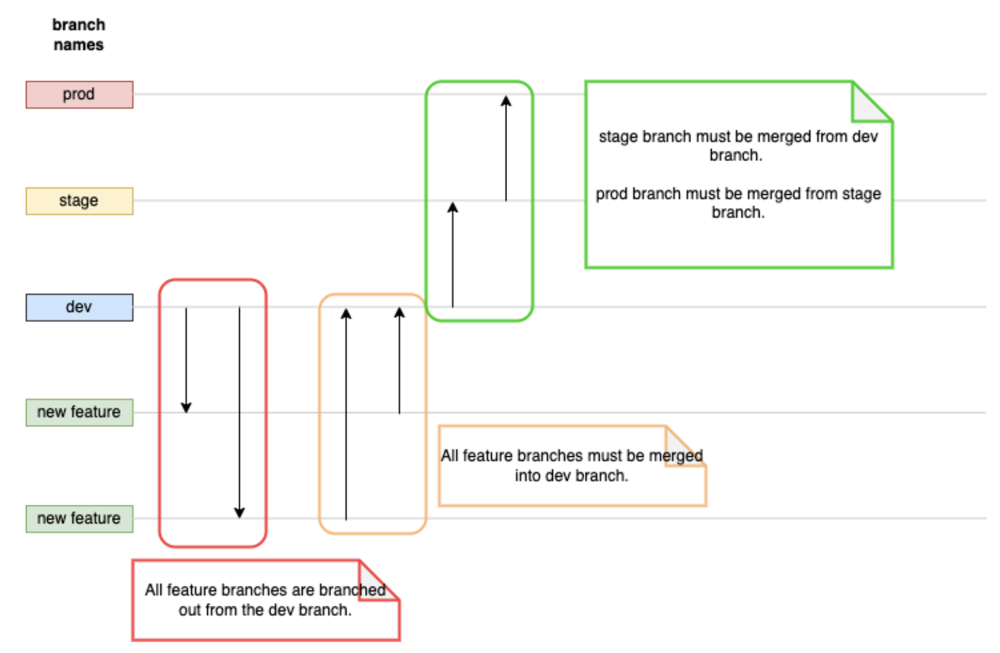

# Capstone Webapp
Web application flask
Build in docker images and upload to ECR which it will deploy to ecs using Fargate.
 
 <b>Two Deployment environment</b>
<ul>
  <li>
    Dev
  </li>
  <li>
    Prod
  </li>
  <li>
    Staging
  </li>
</ul>
 
<h2>Branching Rules</h2>

Infra: https://github.com/chichao89/capstone-infra-demo-v2
